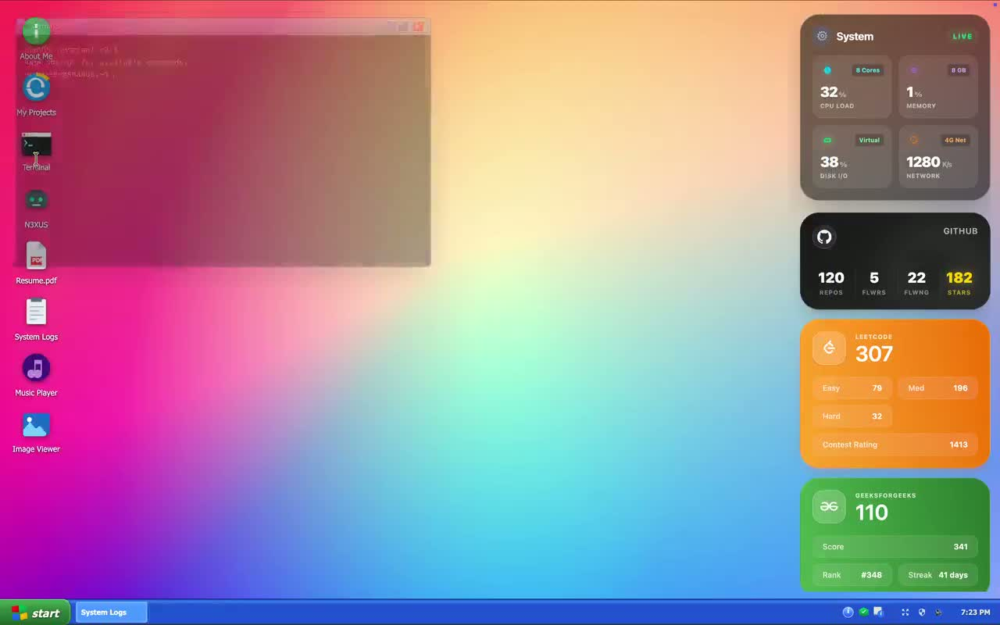

# ShanOS

Interactive portfolio experience by Anjitesh Shandilya, built as a browser-based operating system.

[](https://anji.is-a.dev)
[](https://github.com/ianjiteshan/anji.github.io)

🎥 Demo Video: [Watch the full walkthrough](public/demo/shanos-demo.mp4)

[](public/demo/shanos-demo.mp4)

`ShanOS` combines two portfolio surfaces in one product:

- `OS Mode` — a Windows-XP-inspired desktop with draggable windows, a terminal, widgets, an AI assistant, media apps, and system-style navigation
- `Recruiter Mode` — a faster, cleaner, scroll-based interface designed for recruiters, mobile visitors, and quick evaluation

## Why This Portfolio Stands Out

- Simulates a full desktop operating system in the browser instead of using a standard portfolio template
- Blends frontend engineering, system design thinking, interaction design, and product storytelling
- Demonstrates engineering patterns that feel closer to application architecture than a landing page
- Serves two audiences intentionally: immersive exploration for builders and fast scanning for recruiters

## Features

- 🖥️ Browser-based desktop OS simulation with boot, login, desktop, and shutdown states
- 🪟 Draggable window manager with focus control, z-index orchestration, minimize, maximize, and restore flows
- 💻 Interactive terminal with custom commands like `help`, `projects`, `open pvscan`, `run agent`, `neofetch`, `matrix`, and `flashlight`
- 🤖 Built-in AI assistant with optional live Gemini integration and local fallback mode
- 📂 Project explorer with architecture notes, tech stacks, and challenge summaries
- 📊 Developer metrics widgets for GitHub and coding profile surfaces
- 🎵 Extra desktop apps including a music player, image viewer, resume viewer, and JS Paint
- 🌙 Recruiter Mode with theme toggle, featured projects, experience timeline, and contact funnel

## Modes

### OS Mode

The primary experience for desktop users.

It includes:

- desktop icons and system widgets
- taskbar and start menu
- multi-window interaction
- portfolio terminal
- AI assistant window
- project viewer
- resume viewer
- music player and image viewer

### Recruiter Mode

A streamlined mode optimized for fast review and mobile access.

It includes:

- hero summary and recruiter pitch
- featured and secondary project cards
- experience and education timeline
- coding profile highlights
- resume download and contact actions
- theme toggle and motion-based presentation

Phones default to recruiter mode, while desktop users can switch into it manually.

## Engineering Highlights

- `Zustand` state stores separate window management, UI controls, and system state for cleaner orchestration
- Window manager prevents duplicate launches, restores minimized apps, and promotes focused windows with dynamic z-indexing
- Terminal command engine routes commands to project data, skills, timeline content, boot controls, and UI effects
- Heavy views are modularized by feature and mapped dynamically through lazy-loaded desktop components
- Recruiter Mode and OS Mode share the same content model while presenting different interaction patterns
- AI assistant supports live LLM responses through `VITE_GEMINI_API_KEY` and degrades gracefully to a local knowledge mode

## Performance & Resilience

- App-level code splitting lazy-loads `Desktop`, `RecruiterMode`, and shutdown flows only when needed
- Desktop windows load feature modules on demand, keeping the initial experience lighter
- Mobile visitors default to Recruiter Mode to avoid loading the full desktop UX unnecessarily
- External integrations such as AI and developer metrics fall back gracefully when APIs fail or keys are unavailable
- Suspense-based loading states prevent blank screens during large module transitions

## SEO & Device Support

- Meta description, Open Graph tags, and Twitter card metadata are configured in `index.html`
- Recruiter Mode improves readability and navigation on small screens
- Resume viewing includes mobile and Safari-friendly fallback behavior
- Live demo, GitHub, and video links are placed at the top for better shareability

## How to Explore

### OS Mode

- Double-click desktop icons to open apps
- Use the taskbar and start menu to switch between windows
- Open the terminal and try:
  - `help`
  - `projects`
  - `open pvscan`
  - `open resume`
  - `run agent`
  - `cat resume`
  - `neofetch`
  - `matrix`
  - `flashlight`

### Recruiter Mode

- Scroll through the about, projects, and experience sections
- Toggle the theme from the top navigation
- Use quick actions to view GitHub, download the resume, or jump to contact links

## Tech Stack

- React 19
- TypeScript
- Vite 6
- Tailwind CSS 4
- Framer Motion
- Zustand
- `@xterm/xterm`
- Howler
- React Draggable

## Getting Started

### Install

```bash
npm install
```

### Run the Dev Server

```bash
npm run dev
```

### Build for Production

```bash
npm run build
```

### Preview the Production Build

```bash
npm run preview
```

### Optional Environment Variable

To enable live AI responses inside the desktop assistant, create a `.env.local` file:

```bash
VITE_GEMINI_API_KEY=your_api_key_here
```

Without this key, the AI assistant still works in local fallback mode.

## Project Structure

```text
src/
  core/        stores, hooks, utilities
  data/        projects, skills, timeline data
  features/    feature modules and desktop windows
    ai/
    apps/
    boot/
    effects/
    metrics/
    os/
    projects/
    recruiter/
    resume/
    terminal/
    timeline/
public/
  demo/
  images/
  wallpapers/
  Resume.pdf
```

## Main Entry Points

- [`src/App.tsx`](src/App.tsx)
- [`src/features/os/Desktop.tsx`](src/features/os/Desktop.tsx)
- [`src/features/recruiter/RecruiterMode.tsx`](src/features/recruiter/RecruiterMode.tsx)
- [`src/features/os/StartMenu.tsx`](src/features/os/StartMenu.tsx)
- [`src/features/terminal/Terminal.tsx`](src/features/terminal/Terminal.tsx)
- [`src/core/store/useWindowStore.ts`](src/core/store/useWindowStore.ts)

## Notes

- This repo is intentionally portfolio-first, not a reusable OS framework
- OS Mode and Recruiter Mode are separate experiences with different UX goals
- Some live surfaces depend on external APIs and are designed to degrade gracefully

## Author

Built by Anjitesh Shandilya  
Backend-focused full-stack engineer passionate about systems, AI, and scalable architecture.

- GitHub: https://github.com/ianjiteshan
- LinkedIn: https://linkedin.com/in/ianjiteshan
- Portfolio: https://anji.is-a.dev
- Email: mailto:anjiteshshandilya@gmail.com
